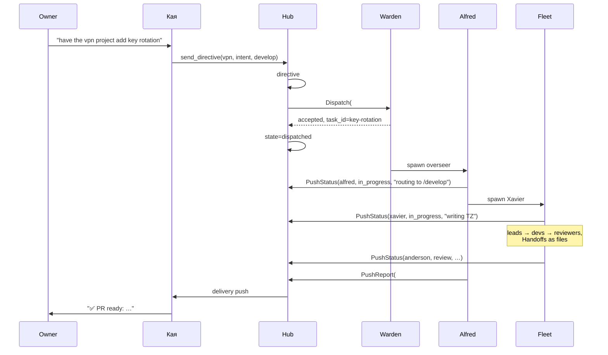

# Tracker v2 — Architecture

<!--
WHAT: The design for the Kaizen tracker as a multi-project agent-work hub, and
      for the per-project service that receives work and drives an agent fleet.

WHY this document exists: the moving parts span three repos-worth of concerns
      (hub, project runtime, agent personas) and four message types. Writing the
      vocabulary and the failure cases down first is cheaper than discovering
      them in code.

HOW to read it: §1 is the vocabulary — everything else assumes it. §2 is the
      picture. §3–5 are the contracts. §6 is the tool surface Кая sees. §7 is
      the behaviour table (the "many cases"). §8 is what changes in code.
-->

---

## 1. Vocabulary

Naming is load-bearing here: the export we're adapting from calls two unrelated
things "command", and that ambiguity is what made its runner brittle. Each name
below has exactly one referent.

### Components

| Name | What it is | Where it runs |
|---|---|---|
| **Hub** | The Kaizen-side tracker: queue, registry, panel, MCP tools. `modules/tracker/`. | Kaizen compose stack |
| **Warden** | Per-project daemon (Python, gRPC). Accepts Directives, spawns agents, reports back. Owns the project's token. The "overseer" in service form. | Each project's container |
| **Alfred** | The overseer *persona* — an LLM agent the Warden spawns per Directive. Reads the Directive and does the work. | Inside the project container |
| **Fleet** | The project's agent personas. **Defaults to Alfred alone** — most Directives don't need more than one persona, and every extra hop between agents is coordination cost paid in tokens, not work done. A project grows its roster only when a Directive genuinely needs separated concerns (e.g. an architect handing a spec to a dev, a reviewer gating a merge) — see "Scaling the fleet" in §8. | Inside the project container |
| **wardenkit** | Shared library Kaizen ships for the project side (gRPC plumbing, status reporting, Directive handling). Mirrors `infra/modkit`. | `infra/wardenkit/` |

**Fleet vocabulary.** Every project runs a different fleet with differently
named personas, so the Hub stores each member's place in one fixed six-word
vocabulary — `owner` → `product` → `architect` → `lead` → `developer` →
`reviewer` (a `tier`) — plus a free-text `area` (which part of the project it works on) and
`reports_to` (the slug above it). That is what the panel draws the org chart
from. A project declares it in its manifest's roster; whatever it leaves blank
the Hub guesses ONCE, on write, and stores the guess, so nothing downstream ever
has to re-derive structure and a wrong guess is visible in `GET /agents`.
`modules/tracker/roster.py` is the single place that decides, and `role` stays
free text — it is the label a human reads, the `tier` is the shape.

Why Warden and Alfred are separate: the Warden is plain infrastructure — it must
answer health checks and accept cancels *while* a pipeline is running, so it
can't be an LLM. Alfred is the judgement layer. Splitting them means a hung
Claude process never makes the project look dead.

On the persona name: **Alfred** (Pennyworth) — a steward who sees everything and
sits above the operatives, which is exactly the role. Fits the export's
pop-culture-plus-scientists roster. Alternatives if you prefer: **Jarvis**
(dispatcher feel), **Gandalf** (gatekeeper feel), **Hagrid** (literally "keeper").

### Messages

| Name | Direction | Lives in | Lifecycle |
|---|---|---|---|
| **Directive** | Кая/owner → Hub → Warden | Hub Postgres | queued → … → done. The unit of work. |
| **Handoff** | agent → agent | File in project repo | Written once, read by the target agent. The export's `{from}-to-{to}-{task-id}.md`. |
| **Status** | agent → Warden → Hub | File + mirrored row | Overwritten on each transition. Progress, blockers. |
| **Report** | Warden → Hub | Hub Postgres | Terminal outcome of a Directive: summary, artifacts, error. |
| **Question** | agent → Warden → Hub → Кая → owner → back | Hub Postgres | Blocks the asking agent until answered. |

Three scopes, no collisions: a Directive crosses a trust boundary and is
tracked; a Handoff is a local file between cooperating agents; Status is
observability.

Why Handoffs stay files: they're greppable, auditable, survive container
restarts, and a human reviewer can read the whole decision trail. Nothing is
gained by putting them in Postgres, and the Hub can't read another project's
disk anyway.

---

## 2. The scheme

```
┌─ Kaizen stack ──────────────────────────────────────────────────────────┐
│                                                                          │
│   Telegram ──► Кая ──MCP/HTTP──► Brain ──gRPC(Module)──► Hub             │
│                 ▲                  │                      (tracker)      │
│                 │                  │                        │            │
│                 └── delivery push ─┘                        │            │
│                     (Question / Report)                     │            │
│                                                             │            │
│                                          Postgres (tracker DB)           │
│                                          projects, directives,           │
│                                          agent_status, questions         │
│                                                             │            │
│                                          panel :8770 (dashboard)         │
└─────────────────────────────────────────────────────┬────────────────────┘
                                                      │
                        Hub dials Warden ─────────────┤  (same machine,
                        (Dispatch / Cancel /          │   compose network)
                         Describe / Health / Restart) │
                                                      │
                        Warden dials Hub ◄────────────┘
                        (Register / Status / Report / Ask)

┌─ project container: vpn ────────┐   ┌─ project container: other ──────┐
│                                  │   │                                  │
│  Warden (gRPC :9200)             │   │  Warden (gRPC :9200)             │
│    │ spawns per Directive        │   │    │                             │
│    ▼                             │   │    ▼                             │
│  Alfred (overseer)               │   │  Alfred                          │
│    │ picks pipeline, spawns      │   │    │                             │
│    ▼                             │   │    ▼                             │
│  Xavier ──► Tesla ──► devs       │   │  (that project's fleet)          │
│         └─► Torvalds ─► devs     │   │                                  │
│         └─► Holmes / reviewers   │   │                                  │
│                                  │   │                                  │
│  docs/tracker/{task-id}/         │   │  docs/tracker/{task-id}/         │
│    tasks/*.md    (Handoffs)      │   │                                  │
│    status/*.yml  (Status)        │   │                                  │
│                                  │   │                                  │
│  the project's own git repo      │   │                                  │
└──────────────────────────────────┘   └──────────────────────────────────┘
```

Both gRPC directions are used, and that's deliberate:

- **Hub → Warden** for *dispatch and control* — the Hub initiates, so a Directive
  reaches the project with no polling latency.
- **Warden → Hub** for *status, reports, and questions* — the project initiates,
  because only it knows when something changed.

This is the same pattern Brain already uses with modules, extended one hop. It
works because everything is on one machine and one compose network. **If a
project ever needs to live elsewhere, only the Hub→Warden leg breaks** — at that
point swap it for a Warden-initiated long-lived stream and keep everything else.
Noting the seam so future-you knows where to cut.

---

## 3. Contracts

Two gRPC services, mirroring `infra/proto/module.proto`.

### 3.1 `Warden` — served by each project, dialed by the Hub

```proto
service Warden {
  // Hand a Directive to the project. Returns immediately (accepted/rejected);
  // execution is async and reported back over the Hub service.
  rpc Dispatch (Directive)      returns (DispatchAck);

  // Abort a running Directive. Best-effort: kills the pipeline, leaves the
  // repo and tracker files as-is for inspection.
  rpc Cancel   (CancelRequest)  returns (CancelAck);

  // Capability manifest — what this project is and what it can be asked to do.
  rpc Describe (DescribeRequest) returns (ProjectManifest);

  // Liveness plus live occupancy.
  rpc Health   (HealthRequest)  returns (WardenHealth);
  // The owner asking a wedged project to pick itself up. The project decides
  // what that means and may refuse; the Hub never restarts anything itself.
  rpc Restart  (RestartRequest) returns (RestartAck);
}

message Directive {
  int64  id            = 1;   // Hub-assigned
  string kind          = 2;   // develop | fix | refactor | research | review | epic | brainstorm | analyze
  string intent        = 3;   // the owner's actual words — Alfred interprets these
  string task_id       = 4;   // optional: continue an existing task-id
  int32  priority      = 5;
  bool   auto_merge    = 6;   // per-Directive opt-in, never global
  map<string,string> meta = 7;
}

message DispatchAck {
  bool   accepted      = 1;
  string reason        = 2;   // why rejected: unsupported kind, at capacity, …
  string task_id       = 3;   // assigned or echoed
}

message ProjectManifest {
  string name          = 1;
  string purpose       = 2;   // one line: what this project is for
  string description   = 3;
  repeated string kinds = 4;  // Directive kinds this project supports
  repeated AgentSpec roster = 5;
  int32  max_concurrent = 6;
  string repo_url      = 7;
  string default_branch = 8;
}

message AgentSpec {
  string slug       = 1;   // the identifier, and the join key used by Status
  string name       = 2;   // what a human is called on the chart
  string role       = 3;   // free text: "Backend Team Lead"
  string model      = 4;
  string area       = 5;   // backend | frontend | android | infra | …
  string reports_to = 6;   // the slug above this one; empty = a root
  string tier       = 7;   // the fleet vocabulary — see §1
}

message WardenHealth {
  bool  ok             = 1;
  int32 running        = 2;
  int32 capacity       = 3;
  repeated int64 running_directives = 4;
}
```

### 3.2 `Hub` — served by the Kaizen tracker, dialed by Wardens

```proto
service Hub {
  // Enrollment: a project announces itself. First call creates a PENDING
  // project; the owner approves via Кая/panel, and a token is issued.
  rpc Register  (ProjectManifest)  returns (RegisterAck);

  // Mirror an agent's Status upward so the panel and Кая can see live progress.
  rpc PushStatus (StatusUpdate)    returns (Ack);

  // Terminal outcome of a Directive.
  rpc PushReport (Report)          returns (Ack);

  // Blocking: an agent needs the owner. The Hub routes to Кая and holds the
  // RPC open until answered or timed out.
  rpc AskOwner   (Question)        returns (Answer);

  // Keeps the Directive's lease alive so the sweeper doesn't requeue it.
  rpc Heartbeat  (HeartbeatPing)   returns (Ack);
}

message StatusUpdate {
  int64  directive_id  = 1;
  string task_id       = 2;
  string agent_slug    = 3;   // architect-xavier, backend-dev-anderson, …
  string role          = 4;
  string state         = 5;   // idle | pending | in_progress | blocked | review | done
  string progress      = 6;
  string blockers       = 7;
  string phase         = 8;   // which pipeline phase the task is in
}

message Report {
  int64  directive_id  = 1;
  string state         = 2;   // done | failed | cancelled | review
  string summary       = 3;
  repeated Artifact artifacts = 4;   // {type, url} — pr, file, dashboard, …
  string error         = 5;
}

message Question {
  int64  directive_id  = 1;
  string agent_slug    = 2;
  string text          = 3;
  int32  timeout_sec   = 4;
  repeated string suggested = 5;  // optional choices, so Кая can offer buttons
}
```

Every Warden→Hub call carries the project's bearer token in metadata; the Hub
resolves it to a project and rejects anything referencing another project's
Directive. Same guarantee `report_task` gives today (`store.py:204`).

### 3.3 What happens to the HTTP API

It stays. `modules/tracker/api.py` keeps serving:

- the **panel** (`/`, `/panel`) — unchanged,
- **claim/report** for *dumb pollers* — a project that doesn't want to run a
  Warden can still participate with ~30 lines, exactly as documented today.

So there are two tiers of integration: a Warden (full fleet, live status,
questions) or a poller (queue in, result out). The Hub doesn't care which.

---

## 4. Directive lifecycle

```
                    ┌─────────── owner cancels ──────────┐
                    │                                     ▼
 queued ──► dispatched ──► running ──► review ──► done  cancelled
   │            │             │  ▲        │
   │            │             ▼  │        └──► failed
   │            │          blocked
   │            │        (question or
   │            │         scope conflict)
   │            └──► queued        (Warden rejected / offline)
   └──► cancelled                  (killed before dispatch)
```

| State | Meaning | Who sets it |
|---|---|---|
| `queued` | In the Hub, not yet handed to a project | Hub on create |
| `dispatched` | Warden accepted it; Alfred is starting | Hub on `DispatchAck.accepted` |
| `running` | Pipeline executing | Warden |
| `blocked` | Waiting on the owner — a Question, or an agent hit out-of-scope work | Warden |
| `review` | PR open, awaiting the owner's decision | Warden |
| `done` / `failed` | Terminal | Warden |
| `cancelled` | Owner aborted | Hub or Warden |

`blocked` and `review` are the two states the current schema can't express, and
both are load-bearing: the export's whole safety model depends on an agent being
able to stop and say "this needs you."

---

## 5. Project enrollment

Reuses the pattern Kaizen already has for agents (ask → owner approves → token
issued once), because it's the same trust problem.

```
1. Warden boots, has no token
2. Warden ──Register(manifest)──► Hub      → project row, state=pending
3. Hub ──delivery push──► Кая: "project 'vpn' wants to enroll: <purpose>"
4. Owner: "approve"  (or `make approve`, or the panel)
5. Hub issues token ──► Warden stores it in its state volume
6. Subsequent Register calls with a valid token just refresh the manifest
```

Why manifest-refresh-on-boot matters: the roster and supported kinds change as a
project grows. The Hub should never hold a stale idea of what a project can do,
and Кая reads capabilities straight from the manifest.

---

## 6. The tool surface Кая sees

All of these live in `modules/tracker/tools.py` and reach Кая as MCP tools
through Brain. **There is no separate MCP server to build** — the tool list *is*
the MCP surface.

| Tool | Behaviour | Status |
|---|---|---|
| `list_projects` | Name, purpose, supported kinds, health, running count | extend |
| `describe_project(project)` | Full manifest + live fleet + queue depth | new |
| `send_directive(project, intent, kind?, priority?)` | Validates kind against the manifest, queues, dispatches | replaces `delegate_task` |
| `directive_status(id)` | State, phase, per-agent status, blockers, artifacts | replaces `task_status` |
| `list_directives(project?, state?)` | Filtered list | extend `list_tasks` |
| `cancel_directive(id, reason)` | Cancels; the `cancelled` state finally reachable | new |
| `reprioritise(project, ordered_ids)` | Reorder the queue | new |
| `pending_questions()` | Questions awaiting the owner | new |
| `answer_question(id, answer)` | Unblocks the waiting agent | new |
| `grant_auto_merge(id)` | Per-Directive merge permission | new |
| `pending_projects()` / `approve_project(name)` | Enrollment | new |
| `project_activity(project?)` | "Who is doing what right now", across projects | new |

Note `send_directive` takes **intent** — the owner's actual words — not a
pre-structured task. Interpretation is Alfred's job, and that's the point of
having him: Кая shouldn't need to know each project's pipeline vocabulary.

---

## 7. Behaviour: the cases

### 7.1 Happy path



### 7.2 The rest

| # | Case | Behaviour |
|---|---|---|
| 1 | **Project offline at dispatch** | `Dispatch` fails → Directive stays `queued`, `dispatch_attempts++`. Hub retries with backoff. Кая tells the owner only after N failures, so a container restart is invisible. |
| 2 | **Warden rejects (unsupported kind)** | `DispatchAck.accepted=false, reason` → Directive → `failed` immediately with the reason. Кая relays it; no silent drop. |
| 3 | **Warden at capacity** | Rejected with `reason=at_capacity` → stays `queued`. Hub retries when a `Health` poll shows a free slot. |
| 4 | **Agent needs clarification** | Agent calls `ask_owner` → Warden → `AskOwner` RPC, held open. Directive → `blocked`. Hub pushes to Кая, who asks the owner *conversationally*. Owner answers → `answer_question` → RPC returns → agent resumes, Directive → `running`. Replaces the export's 5-minute poll-then-give-up. |
| 5 | **Question times out** | RPC returns empty after `timeout_sec`. Alfred decides: proceed under a stated assumption, or Report `failed` with "no answer". Never silently guesses. |
| 6 | **Agent hits out-of-scope work** | Dev sets its Status to `blocked` with `blockers`. Alfred sees it, stops the pipeline, Reports `blocked`. Owner decides whether to widen scope. (The export's infra-ownership rule, made visible to the Hub.) |
| 7 | **Owner cancels mid-flight** | `cancel_directive` → Hub → `Cancel` RPC → Warden kills the pipeline, leaves repo and `docs/tracker/` intact for inspection → Report `cancelled`. |
| 8 | **Warden crashes mid-Directive** | `Heartbeat` stops. Hub's sweeper sees an expired lease → Directive → `queued`, and re-dispatches on the Warden's next `Register`. This is the dead-claim hole in the current schema, closed. |
| 9 | **Hub restarts with work in flight** | Directive rows are durable; Wardens keep working and their `PushStatus`/`PushReport` calls retry with backoff. On boot the Hub polls `Health` on every registered project to resync `running_directives`. |
| 10 | **Review finds must-fix issues** | Entirely internal — Alfred re-spawns the dev and re-runs review. Hub sees only `PushStatus` phase changes. The Hub deliberately doesn't model pipeline internals. |
| 11 | **Build fails** | Same: internal retry loop. If it can't be fixed, Report `failed` with the build log tail as `error`. Never opens a PR on a failing build. |
| 12 | **PR open, awaiting owner** | Report `review` + artifact. Owner reviews; either merges themselves, or `grant_auto_merge(#12)` → Hub → new Directive kind `review` → Alfred self-reviews the diff, merges, Reports `done`. |
| 13 | **Epic** | `send_directive(kind=epic)` → Alfred spawns Xavier in decomposer mode → Xavier returns 3–7 ordered items → Alfred calls back with `PushReport(done)` **plus** proposed child Directives. Hub queues them with ascending priority, `parent_id` set. Owner confirms via Кая before any run. |
| 14 | **Two Directives at once** | Alfred is spawned *per Directive* (fresh context), bounded by `max_concurrent`. Distinct `task_id`s → distinct `docs/tracker/{task-id}/` trees → no file collisions. This is what fixes the export's one-at-a-time busy lock and its `--continue` context bleed. |
| 15 | **"What's everyone doing?"** | `project_activity()` with no argument → every project's live fleet from mirrored Status. One question, whole estate. The thing the export's per-project dashboard structurally cannot do. |
| 16 | **Token leak / rotation** | `rotate_token(project)` → new token issued, old invalidated. Warden's next call gets `UNAUTHENTICATED` → re-enrolls → owner re-approves. Same self-healing path as Кая's tokens. |

---

## 8. What changes in code

### Hub — `modules/tracker/`

**Schema** (`models.py`):
- `tracker_projects`: `+ purpose`, `+ description`, `+ state` (pending|active|disabled), `+ manifest` JSONB, `+ max_concurrent`, `+ grpc_addr`, `+ last_seen_at`
- `tracker_tasks` → **`tracker_directives`**: `+ kind`, `+ priority`, `+ task_id`, `+ parent_id`, `+ auto_merge`, `+ lease_expires_at`, `+ dispatch_attempts`; status set extended with `dispatched`, `blocked`, `review`
- **new** `tracker_agent_status`: mirrored per-agent Status (directive_id, agent_slug, role, state, progress, blockers, phase, updated_at) — LATEST only, overwritten per (directive_id, agent_slug)
- **new** `tracker_agent_usage`: an append-only ledger, one row per persona turn that reported token usage (directive_id, agent_slug, phase, input/output/cache tokens, cost_usd, created_at) — unlike Status, nothing else records this, so it's kept as history rather than overwritten. Powers the panel's Analytics tab, which is how "would a crew have cost more than Alfred alone?" gets answered from data instead of a guess.
- **new** `tracker_questions`: directive_id, agent_slug, text, answer, asked_at, answered_at
- `tracker_agents` stays as the roster, now refreshed from the manifest

**New surfaces**: `hub_grpc.py` (the `Hub` service), `dispatcher.py` (dial Wardens, retry/backoff, capacity), `sweeper.py` (lease expiry → requeue). Extend `tools.py` per §6 and `panel.py` for the cross-project fleet view.

**Fix while we're here** — the gaps found in review: no transition validation
(`store.py:222` lets a terminal Directive move back), stale module headers
(`app/tracker/` paths, "its own two tables"), and zero tests. The atomic claim
and the token boundaries are what most deserve tests.

### Shared — `infra/`

- `infra/proto/warden.proto` + generated code
- `infra/wardenkit/` — Warden base (gRPC server, Hub client, Status/Report/Ask helpers, `docs/tracker/` file conventions). The project side imports this and nothing else from Kaizen.
- `infra/wardenkit/pipeline.py` — `run_persona_turn(job, runner, slug, prompt, *, phase, ...)`: the one place a persona turn happens (status→run→status), used by every topology. See "Scaling the fleet" below.

### Scaling the fleet

A Directive's handler defaults to one `run_persona_turn()` call — Alfred does
the work, no handoff, no second persona to pay context for. Growing the fleet
is not an architecture change: `wardenkit` has no opinion on agent count
(`WardenServicer` only requires the handler return a `JobResult`). To add a
persona, add one more `run_persona_turn()` call with a different `slug` and
one `job.handoff()` between them — exactly the shape
`example/dummy-project/warden.py`'s architect→dev→reviewer pipeline already
uses. Usage capture rides along automatically: `run_persona_turn()` reads
`CliRun.usage` off every `ClaudeRunner` call and pushes it with the Status, so
the Analytics tab shows the real cost of whatever topology a project chose —
the number that should decide whether a Directive earns a second persona, not
a default team roster.

### Per project

Everything that references *that repo's* code:
- `.claude/agents/*.md` — the fleet, adapted (the export's 19 is a starting roster, not a target)
- `.claude/commands/*.md` — pipelines
- `alfred.md` — the overseer persona
- `warden.py` — thin: `wardenkit` + this project's config
- `Dockerfile` — that project's toolchain + `claude` CLI
- `docs/tracker/` — Handoff and Status files

**Carry over verbatim** from the export's safety rules: agents never touch
`main`, never `git revert`, never auto-resolve conflicts, auto-merge is
per-Directive opt-in. Those five are the only thing standing between
`--dangerously-skip-permissions` and a bad afternoon.

---

## 9. Build order

1. Hub schema + state machine + transition validation + tests
2. `warden.proto` + `wardenkit` skeleton
3. Hub gRPC service (Register / PushStatus / PushReport / Heartbeat)
4. Dispatcher + lease sweeper
5. `tools.py` → the §6 surface; Report/Question → Brain delivery → Кая
6. Panel: cross-project fleet view
7. A **dummy project** with one trivial pipeline — proves enrollment, dispatch,
   status, questions, cancel, crash recovery, without real code in the way
8. Only then: the VPN project's real fleet
